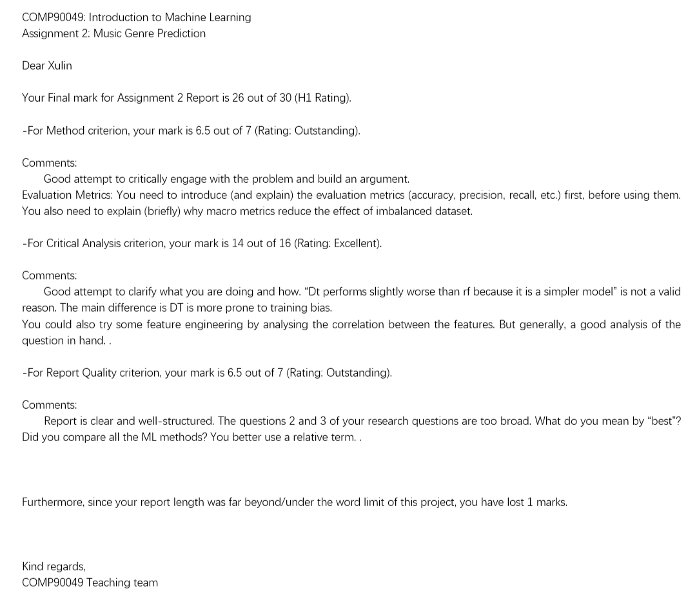
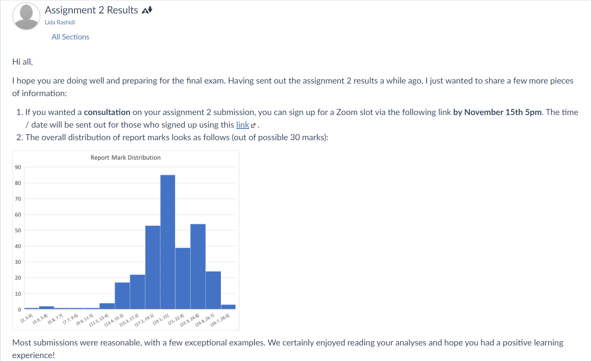
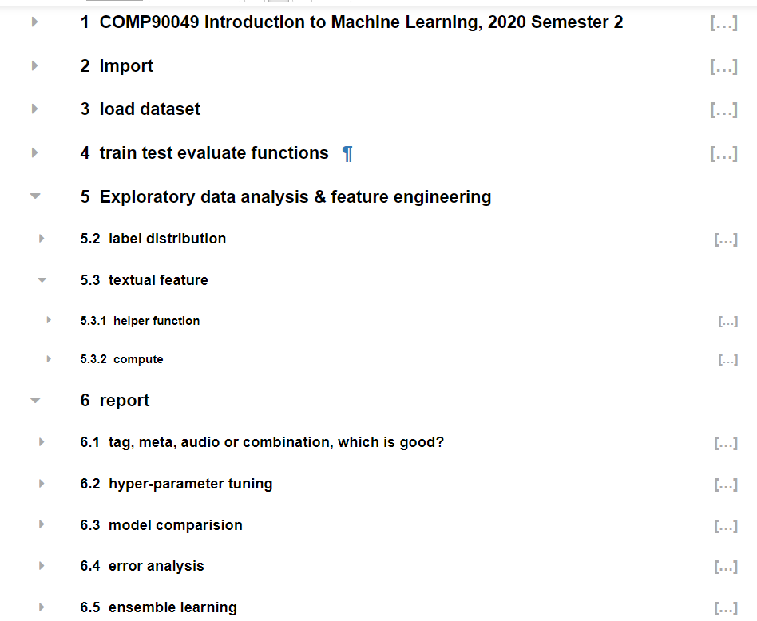

# 1. Music-genre-classifier
COMP90049 - Intro to Machine Learning - 2020S2 - Assignment2
<!-- TOC -->

- [1. Music-genre-classifier](#1-music-genre-classifier)
  - [1.1. Library used](#11-library-used)
  - [1.2. Report](#12-report)
  - [1.3. Kaggle](#13-kaggle)
  - [1.4. Peer review](#14-peer-review)
    - [1.4.1. Anonymous User, Oct 19 at 15:13](#141-anonymous-user-oct-19-at-1513)
    - [1.4.2. Anonymous User, Oct 21 at 0:42](#142-anonymous-user-oct-21-at-042)
  - [1.2. Result and feedback](#12-result-and-feedback)
- [2. how to run](#2-how-to-run)
- [3. where to find functions](#3-where-to-find-functions)
  - [3.1. TF-IDF](#31-tf-idf)
  - [3.2. train, predict, evaluate functions](#32-train-predict-evaluate-functions)
  - [3.3. hyper-parameter tuning](#33-hyper-parameter-tuning)
  - [3.4. error analysis](#34-error-analysis)
  - [3.5. ensemble learning](#35-ensemble-learning)
- [2. For more details, read the jupyter notebook](#2-for-more-details-read-the-jupyter-notebook)
  - [2.1. description](#21-description)
    - [2.1.1. Data splits and format](#211-data-splits-and-format)
    - [2.1.2. Features](#212-features)
    - [2.1.3. Labels](#213-labels)

<!-- /TOC -->

## 1.1. Library used
- sklearn
- numpy
- pandas

## 1.2. Report
- [report](./docs/COMP90049_Assignment_02.pdf)

## 1.3. Kaggle
- https://www.kaggle.com/c/comp90049p2s2/leaderboard
- I am rank 176
- 

## 1.4. Peer review
- [peer reviews](./peer_review/)

### 1.4.1. Anonymous User, Oct 19 at 15:13
- The scientific report on Music Genre Classification gives a sight of the breadth of nowledge that has been gained from experimenting with various classifiers. The main focus of  this report was to find answers to the following questions:
    1)	Does using a combination of textual, meta, audio features perform best?
    2)	Is Gaussian Naive Bayes the most accurate model on the given MGC data-set in terms of accuracy and macro-f1?
    3)	Is Gaussian Naive Bayes the most general model on the given MGC data-set?
    Information about the experiment carried out in the report begins with the overview of datasets, followed by brief explanation of various models, evaluation metric and hyper-parameter tuning used in the experiment. Moving further, the different models that have been considered are compared based on selected metric system (accuracy and macro-f1) and a brief error analysis is done.
    - A cursory discussion on Ensemble Learning is an add-on in the paper, before the conclusion.
- This paper gives a good insight into available classifiers. It also can be a good source of knowledge to find out various criteria that are to be considered while experimenting with datasets for a machine learning task. The author has discussed the distribution of genre labels in training and validity datasets. A good explanation of effects of this distribution is also provided on various classifiers. The discussion on feature pre-processing and selection gives a good insight about the data being used. Additionally, the short description of various hyper-parameter tunings applied to the models helps readers to understand author’s judgement for using them. Besides, the author has also given explanation about each choice that was made during the experiment. The strongest aspect of this scientific paper is the use of multiple graphs for visual representation and better understanding.
- However, one of the eye-catching flaws of the paper is the ambiguous use of “benchmark” keyword along with “baseline” keyword. Moreover, even though it is evident that the report has covered a wide area of research, it could have been better if some deep-insights were offered on the questions in consideration. Other downsides of this report are the use of casual language and the exceeding word limit. 
- After reading the report, I feel the report could not do justice to the effort that the author had put in experimenting with the data, to build models to solve Music Genre Classification task.

### 1.4.2. Anonymous User, Oct 21 at 0:42
- Briefly summarize what the author has done in one paragraph: 
  - In this report, the author first aimed to explore which combination of the three feature categories performed the best when using the Gaussian Naïve Bayes classifier. The author then turned their attention to use the best performing feature selection on the Gaussian Naïve Bayes, Multinomial Naïve Bayes, Categorical Naïve Bayes, Decision Trees, Bagged Decision Trees, Random Forest and Multilayer Perceptron classifiers in order to decide on the best classifier for musical genre prediction. The results showed a feature selection containing all three feature categories combined with the Gaussian Naïve Bayes classifier resulted in the highest accuracy.
- Indicate what you think that the author has done well, and why in one paragraph: 
  - I believe that the setup for the different classifiers was detailed and methodical. The use of Hyper-parameter tuning for the Knn, Decision Trees, Random Forest and multilayer perceptron classifiers results in more optimized models and reduced over-fitting which improves performance. Furthermore, the model performance comparison was comprehensive and demonstrated proper understanding of the underlying models. Finally, the author’s treatment of the imbalance of label distribution in the training and validation sets was well handled. This is evident by the use of macro evaluation metrics and cross-validation to offset the imbalance and its impact on the predictions.
- Indicate what you think could have been improved, and why in one paragraph:
    - I believe the main issue here was that research questions 2 and 3 in particular contained rather weak hypotheses. Gaussian Naïve Bayes is generally viewed as a relatively basic classifier and should not be expected to outperform any other more complex classifier so having the hypothesis focusing on the performance of Gaussian Naïve Bayes was not the best approach. Additionally, the “most general model” statement in question 3 is vague and causes some confusion for the reader about the purpose of including this question. Furthermore, there is room for improvement in the wording and style of the report to better convey the author’s ideas.

## 1.2. Result and feedback
- Final marks: 36 out of 40
- 
- 
- 
- 
- 
- 
- [good report](./ExampleReport.pdf)

# 2. how to run
- run all cells
- everything in report are in all cells
- 

# 3. where to find functions

## 3.1. TF-IDF
- section 5.3

## 3.2. train, predict, evaluate functions
- defined in section 4
- called in section 6.3

## 3.3. hyper-parameter tuning
- section 6.2

## 3.4. error analysis
- section 6.4

## 3.5. ensemble learning
- section 6.5

# 2. For more details, read the jupyter notebook

## 2.1. description
This file describes the data provided as part of  
COMP90049: Introduction to Machine Learning  
Project 2: Music Genre Prediction from Audio, Metadata, and Lyric Features!

The features and class labels are derived from the following published data sets

1. T. Bertin-Mahieux, D. P.W. Ellis, B. Whitman, and P. Lamere. The million song dataset. In Proceedings of the 12th International Conference on Music Information Retrieval (ISMIR),

2. A. Schindler and A. Rauber. Capturing the temporal domain in Echonest Features for improved classification effectiveness. In Proceedings of the 10th InternationalWorkshop on Adaptive Multimedia Retrieval (AMR), 2012.

### 2.1.1. Data splits and format
The data set consists of audio, metadata, and text features for 8556 songs, as well as their
genre labels. The songs are split into a training set (7678 songs), development set (450 songs) and test set (428 songs).

For each data split, we provide a features.csv file, labels.csv file. Each file is in csv format 
(comma-separated values). 

### 2.1.2. Features

The feature files (train_features.csv, valid_features.csv and test_features.csv) contains the following columns:

* trackID: unique identifier for each song (to be used for mapping songs to their labels)
* title: title of the song. Type: text.
* tags: A comma-separated list of tags representing the words that appeared in the lyrics of the song and are assigned by human annotators. Type: text / categorical.
* loudness: overall loudness in dB. Type: float / continuous.
* tempo: estimated tempo in beats per minute (BPM). Type: float / continuous.
* time_signature: estimated number of beats per bar. Type: integer.
* key: key the track is in. Type: integer/ nominal. 
* mode: major or minor. Type: integer / binary.
* duration: duration of the song in seconds. Type: float / continuous.
* vect_1 ... vect_148: 148 columns containing pre-computed audio features of each song. These features were pre-extracted from the 30 or 60 second snippets, and capture timbre, chroma, and mfcc aspects of the audio. Each feature takes a continuous value. Type: float / continuous.
 

### 2.1.3. Labels

  
The label files (train_labels.csv and valid_labels.csv) contain the following columns:

* trackID: unique identifier for each song (to be used for mapping songs to their labels)
* genre: the genre label

All genre labels are taken from the following set of 8 genres:

1. Soul and Reggae
2. Pop
3. Punk
4. Jazz and Blues
5. Dance and Electronica
6. Folk
7. Classic Pop and Rock
8. Metal
